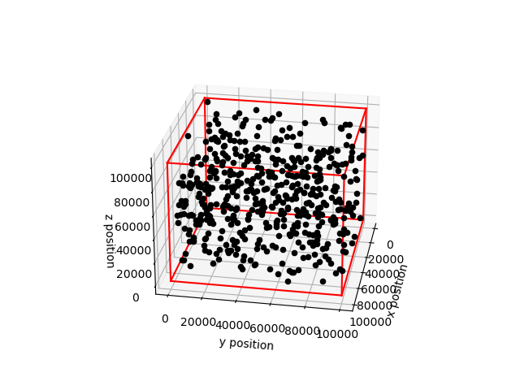

# Python 3D Particles in a Box Classical Monte-Carlo Simulation
This simulation uses the Monte-Carlo method to simulate N interacting particles in 3D. Particles interacted with periodic, specular and thermal walls of the box and various properties of the particles such as the mean velocity, mean kinetic energy, temperature were analysed and plotted. There is a variety of animated plots of the simulation elapsing in 3D as well as how the distribution of velocities change over time.

### Outline
- `montecarlosim`: File containing a class to setup a simulation instance from the `config` file. Contains the main bulk of the code where the numerical methods and calculations take place.
- `Analysis`: File containing code that can plot/animate various properties of the simulation from a file containing the output data from `montecarlosim`.
- `unit_test`: File containing unit tests of every method in `montecarlosim` using pytest.
- `config`: json configuration file where various aspects of the simulation can be changed such as the number of particles, length of the box, time step, mass of the particles as well as the temperature of the dilute gas and thermal walls.

### Libraries Used

- NumPy
- Numba
- SciPy
- pandas
- matplotlib
- pytest
- json
